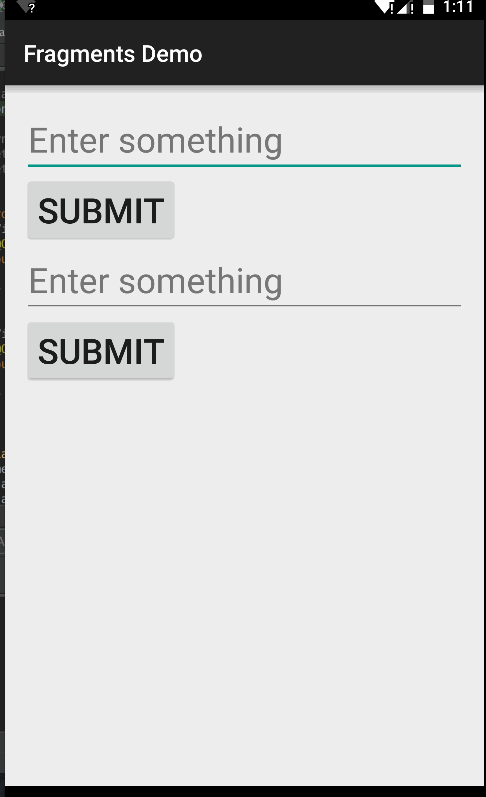
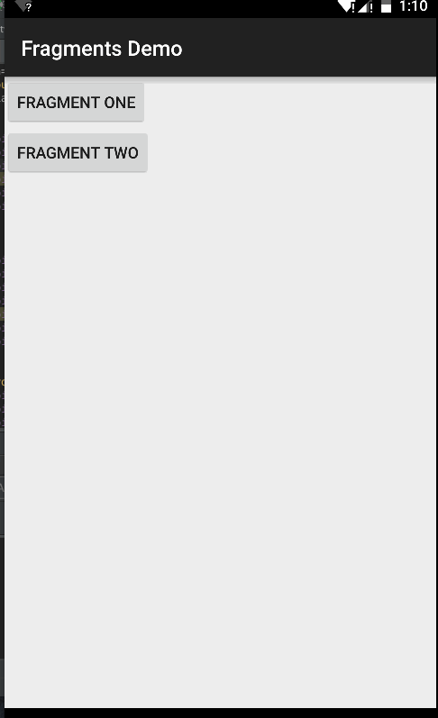

# Fragments Demo

## Exercise 1: Static Fragments
Statically embed a fragment multiple times into a single activity.  Display the `EditText` contents from each fragment to demonstrate that each fragment is its own independent instance.

## Exercise 2: Dynamic Fragments
Dynamically replace fragments within a container on the right side of an `Activity`'s layout.

